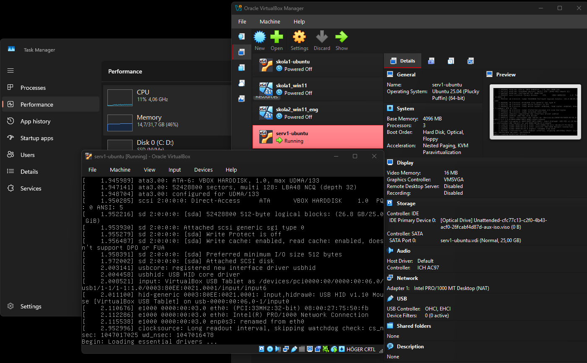
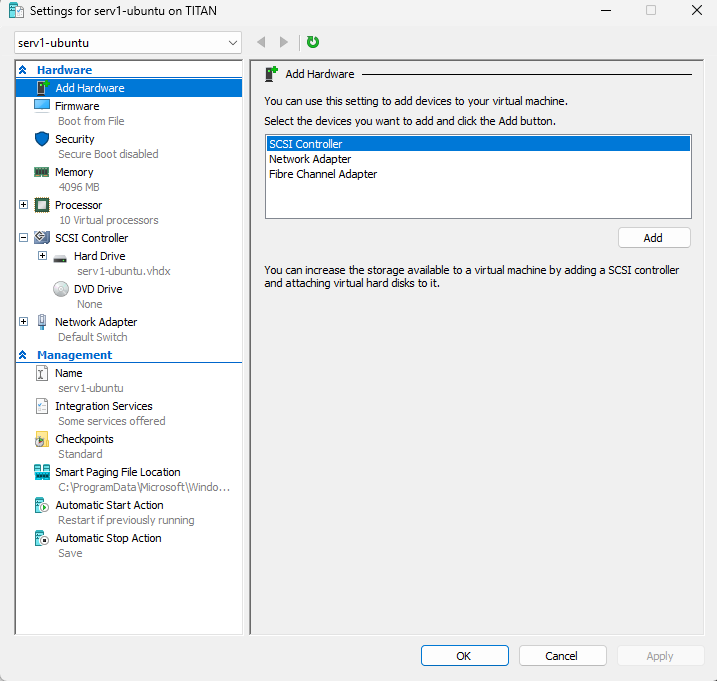
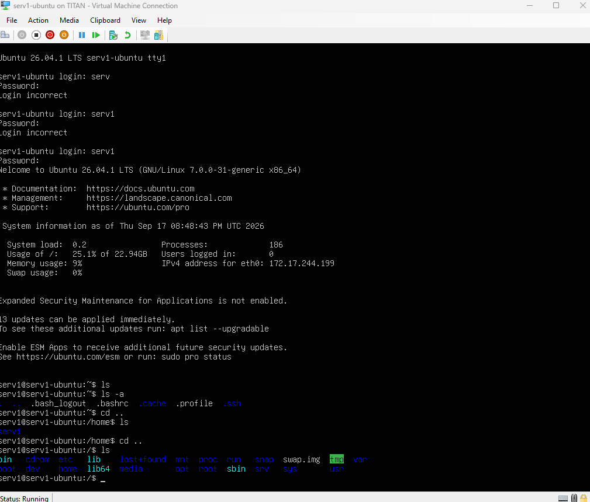
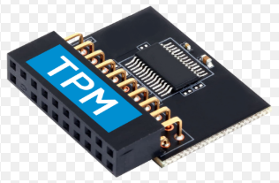
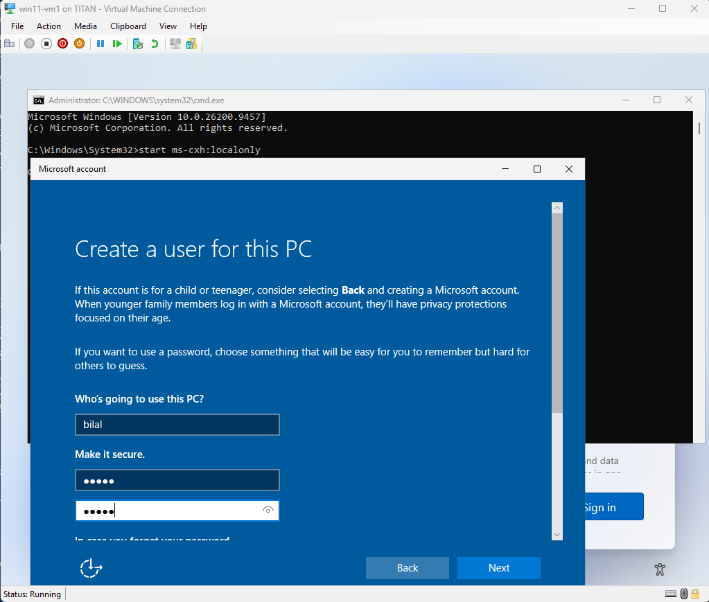
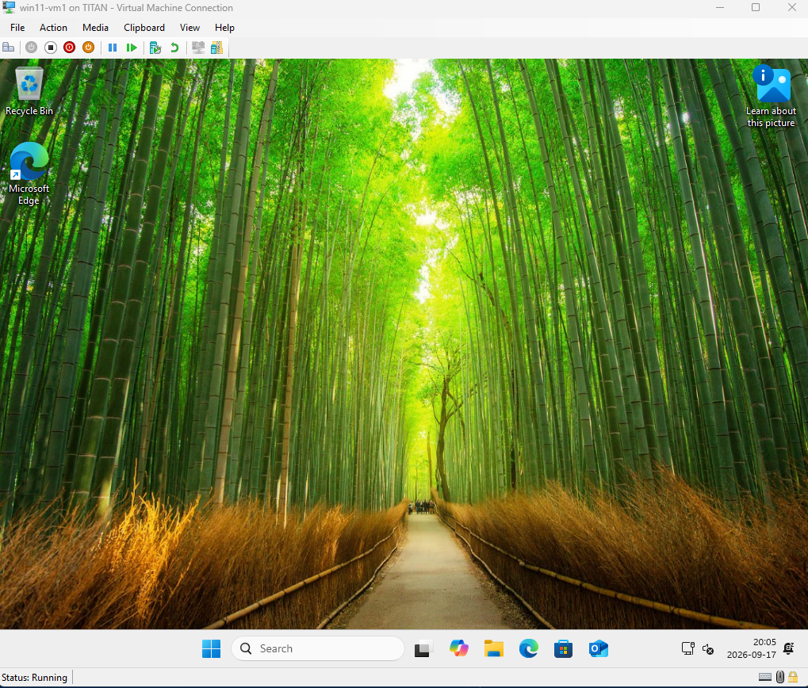
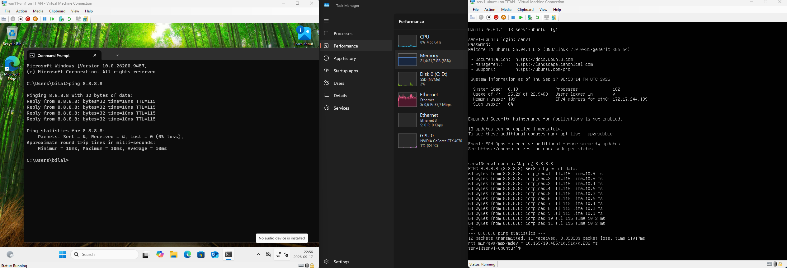

# **Del 2: Virtuell Labbmiljö & Nätverk (Kursmål 8)**  
## **I detta uppgift ska jag göra följande..**  

#### **Del 1. Förklara vad `Viretuell Maskin(VM)` är, (lite djupt).**  

#### **Del 2. Sätt upp två virtuella maskiner i [Oracle VirtualBox](https://www.virtualbox.org/wiki/Downloads)**  

>- En Linux-Server (**[Ubuntu-Server](https://ubuntu.com/download/server#how-to-install-tab-lts)**)  
>- En Windows-Klient (**[Windows 11](https://www.microsoft.com/en-us/software-download/windows11)**)  

#### **Del 3. Placera båda maskinerna på ett gemensamt internt nätverk (`Internal Network`) så att de kan kommunicera med varandra.**  
#### **Del 4. Konfigurera statiska IP-adresser på båda maskinerna så att de ligger i samma subnät `(t.ex. 192.168.1.50/24 och 192.168.1.51/24)`.**  
#### **Del 5. Dokumentera miljön strukturerat i en tabell som innehåller: Hostname,Operativsystem, IP-adress, Subnätmask och Standard Gateway.**  
***  


>**Del 1. Förklara vad `Viretuell Maskin(VM)` är, (lite djupt).**  
### Varför används det ?  
- Istället för att köpa flera datorer, väljer företag att köpa en kraftfull dator/server som kan köra flera *`Viretuell Maskin(VM)`* samtidigt.  
På så sätt istället för att företaget ska betala mycket pengar för att underhålla flera fysiska datorer så underhåller det bara en erom kraftfull dator/server. 
- Säkerhet / Testmiljö: Testa på nya system/programuppdateringar/länkar, ifall nåt går illa då stannar hotet inne i denna isolerade (VM). 
### Hur funkar det ?
1. När du startar en dator så vaknar `BIOS/UEFI/Bootloader` till liv och bootar din dator, sedan tar `(Kernel)` över och ser till så att dina komponenter kommunicerar, och får att det har tillräckligt med resurser för att dator ska kunna funka.

2. Nu tar gränssnittet `(Shell/Bash)` över. `(Shell/Bash)` tar kommando från användare och översätter det så att din dator förstår dig.

***`Hypervisor`* : Det är programvara som *`(Oracle VirtualBox, Hyper-V, VMware)`*, du laddar ner för att kunna skapa en/fler *`Viretuell Maskin(VM)`.***  

>- (**[Oracle VirtualBox](https://www.virtualbox.org/)**)  
>- (**[Hyper-V](https://learn.microsoft.com/en-us/windows-server/virtualization/hyper-v/get-started/install-hyper-v?tabs=powershell&pivots=windows)**)  
>- (**[VMware](https://www.vmware.com/products/desktop-hypervisor/workstation-and-fusion)**)  

**`Hypervisor` abetar med `Kernel` så att resurserna tilldelas till nya `Viretuell Maskin(VM)`.**  
### Hur startar jag en `Viretuell Maskin(VM)` och vad bör jag tänka på ?  

1. Ladda ner en *`Hypervisor`* som...  

>- (**[Oracle VirtualBox](https://www.virtualbox.org/)**)  
>- (**[Hyper-V](https://learn.microsoft.com/en-us/windows-server/virtualization/hyper-v/get-started/install-hyper-v?tabs=powershell&pivots=windows)**)  
>- (**[VMware](https://www.vmware.com/products/desktop-hypervisor/workstation-and-fusion)**)  

2. Välj vilken tilldelning `.iso`(Operativsystem) din `Viretuell Maskin(VM)` ska ha.  

>- **[**Windows** ](https://www.microsoft.com/en-us/software-download)**  
>- **[**macOS** ](https://support.apple.com/en-us/102662)**  
>- **[**Linux** ](https://www.linux.org/pages/download/)**  

<span style="color: red; font-weight: bold;">VIKTIGT:</span> `.iso`-filen måste matcha din `Host` processorarkitektur eftersom `Hypervisor` skickar instruktioner direkt till din CPU.  
När du väljer tilldelning kolla även på  `System requirements` där hittar du info om hur stort utrymme behöver det äta av din disk för att köras.   
Välj `.iso` utifrån vilken CPU du har i din HOST. Titta nedan.  

- (x64 eller AMD64 / intel 64) är standart till PC Stationär dator (Intel & AMD) CPUer.
- (ARM64 eller AArch64) är standard för Apple CPU(M1 uppåt..) och mobiltelefoner.  


Öppna `Task Manger` och se vad din `Host` anvädner för resurser, för att hålla sig igång. Du vill inte att den ska hänga sig när du kör `2 VM` samtidigt.
***  
> #### **Del 2. Sätt upp två virtuella maskiner i [Oracle VirtualBox](https://www.virtualbox.org/wiki/Downloads)**  

- En Linux-Server (**[Ubuntu-Server](https://ubuntu.com/download/server#how-to-install-tab-lts)**)  
- En Windows-Klient (**[Windows 11](https://www.microsoft.com/en-us/software-download/windows11)**)  

**Min HOST**  
- Intel i7, 12 Cores. 32GB RAM, Problemet är att min Host anvädner 60% av RAM.  
--Jag stängde ner lite saker i bakrunden så nu min Host använder 45% av RAM.  
- Använder *`Hypervisor`* : **[Oracle VirtualBox](https://www.virtualbox.org/)**  

**Frågan är:** Hur ska jag tilldela resurser, ska kunna köra min **Host** + **[Ubuntu-Server](https://ubuntu.com/download/server#how-to-install-tab-lts)** +  **[Windows 11](https://www.microsoft.com/en-us/software-download/windows11)**.


1. Använder *`Hypervisor`* : **[Oracle VirtualBox](https://www.virtualbox.org/)**, fick byta till (**[Hyper-V](https://learn.microsoft.com/en-us/windows-server/virtualization/hyper-v/get-started/install-hyper-v?tabs=powershell&pivots=windows)**)😑 
2. Laddade ner `.iso` filer för **[Ubuntu-Server](https://ubuntu.com/download/server#how-to-install-tab-lts)** +  **[Windows 11](https://www.microsoft.com/en-us/software-download/windows11)**.  


> Sätter upp **[Ubuntu-Server](https://ubuntu.com/download/server#how-to-install-tab-lts)** `serv1-ubuntu`   

Öppnade **[Oracle VirtualBox](https://www.virtualbox.org/)** > New > VM Name: Serv1-unbuntu > ISO image [Ubuntu-Server](https://ubuntu.com/download/server#how-to-install-tab-lts) > 4-Gb Ram > 3 cores > Disk size 25-GB > 

  
Jag har fått problem, som du ser det har hängt sig (flera gånger).  
Efter lite felsökning visade det sig att en grön sköldpadda tyder på att system är långsam, det kan bero på att Windows vill att vi använder Windows tjänster istället 😑.  
Det jag ska göra är att byta `Hypervisor` till (**[Hyper-V](https://learn.microsoft.com/en-us/windows-server/virtualization/hyper-v/get-started/install-hyper-v?tabs=powershell&pivots=windows)**) få hoppas att det löser sig.😑

Efter lite strul för jag är inte van vid **[Hyper-V](https://learn.microsoft.com/en-us/windows-server/virtualization/hyper-v/get-started/install-hyper-v?tabs=powershell&pivots=windows)** 

Öppnade jag en **[Youtube Video](https://www.youtube.com/watch?v=CFyJWgBCp7I)** för att få hjälp.  


<span style="color: red; font-weight: bold;">VIKTIGT:</span> **Vad hände nu ?**  
**Öppnade **[Hyper-V](https://learn.microsoft.com/en-us/windows-server/virtualization/hyper-v/get-started/install-hyper-v?tabs=powershell&pivots=windows)** > New > VM Name: `serv1-unbuntu` > ISO image [Ubuntu-Server](https://ubuntu.com/download/server#how-to-install-tab-lts) > 4-Gb Ram > Disk size 50-GB > **Network Adapter = Default Switch så att VM och min dator ska kunna nå varandra.** > Stängde ner Secure Boot: fråga mig vrf😅  > Start > aktiverat SSH (om man vill fjärrstyra servern😁).**  


- Jag stänger ner `Secure boot` eftersom **Hyper-V med Gen2** vägrar att boota den. `Secure boot` finns före att man bootar enheten, eftersom den letar i filerna efter nån `virus` innan man botar maskinen. Förmodlingen tror `Secure boot` att `.iso` filen innehåller nått okänt därför bootas den inte.  


.



Okej det är första gång jag öppnar en Ubuntu server 😁 så stolt.  
Det första jag la till märke att i **/serv1** när man kör `ls` då ser man inte filer som `/bilder` man kan endast se dolda filer med hjälp av `ls -a`.


> Sätter upp **[Windows 11](https://www.microsoft.com/en-us/software-download/windows11)**-klient `win11-vm1`

**Öppnade **[Hyper-V](https://learn.microsoft.com/en-us/windows-server/virtualization/hyper-v/get-started/install-hyper-v?tabs=powershell&pivots=windows)** > New > VM Name: **win11-vm1** > **4-Gb** RAM > Connection : **Default Switch**,> 80 GB storage > iso = **[Windows 11](https://www.microsoft.com/en-us/software-download/windows11)** > slå på TPM .**  
- `TPM-chippet` finns för att lagra säkert `våra nycklar, Pinkod, lösenord.` chippet är helt isolerat från resten av datorn. försöker man bryta in sig i den då låser den sig helt (nästan omöjlig att öppna igen).  





**Nu har jag min [Ubuntu-Server](https://ubuntu.com/download/server#how-to-install-tab-lts) `serv1-ubuntu` + och min **[Windows 11](https://www.microsoft.com/en-us/software-download/windows11)**-klien `win11-vm1` som ligger på **[Hyper-V](https://learn.microsoft.com/en-us/windows-server/virtualization/hyper-v/get-started/install-hyper-v?tabs=powershell&pivots=windows)****  

- När jag boota min `win11-vm1` kom det upp att jag behvöver göra `Sign in` med mitt konto. Förr i tiden kunde man hoppa över denna steg, men `Microsoft` har tydligen tagit bort denna alternativ, därför fick lite hjälp av `Ai` att hoppa över denna steg, genom att öppna terminalen och skriva följande kod.  
```  
ms-cxh:localonly
```


  



***  

> **Del 3. Placera båda maskinerna på ett gemensamt internt nätverk (`Internal Network`) så att de kan kommunicera med varandra.**

- Jag började med att starta mina [Ubuntu-Server](https://ubuntu.com/download/server#how-to-install-tab-lts) `serv1-ubuntu` + och min **[Windows 11](https://www.microsoft.com/en-us/software-download/windows11)**-klien `win11-vm1` som ligger på **[Hyper-V](https://learn.microsoft.com/en-us/windows-server/virtualization/hyper-v/get-started/install-hyper-v?tabs=powershell&pivots=windows)** och pinga 8.8.8.8 (Google) för att se om det är kopplade till `WAN` eller inte.(både är kopplade till internet)  



**Just nu sitter både enheter på netvärk kortet `Default Switch` Just nu kan dessa enheter surfa på nätet, det som vi ska göra är att `inte låta dom surfa med nätet`, vi ska dra en kabel från `win11-vm1` eth till `serv1-ubuntu` eth, att det bara kan se varandra.**  
### För att göra detta ska vi...  
**1. Vi ska ha bara en kabel som är dragen från `win11-vm1`eth1 till `serv1-ubuntu` eth1 . Med andra ord skpa `Internal Network` så att våra maskiner ser bara varandra**  
**2. Vi ska tilldela statiskt ip addresser till `win11-vm1`(192.168.1.50) och `serv1-ubuntu` (192.168.1.51) så att DHCP inte byter addressen varje gång man bootar enheten.**


