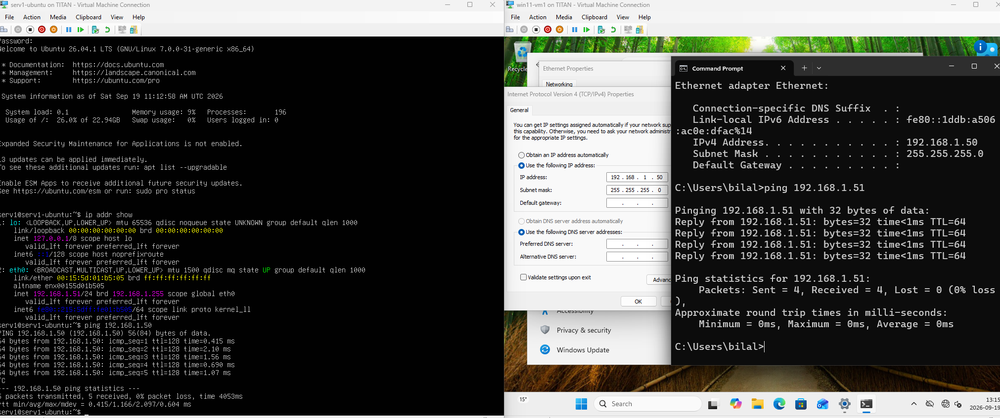
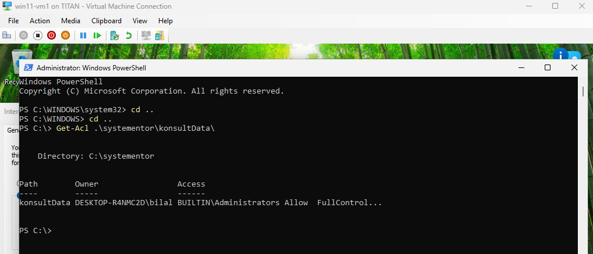
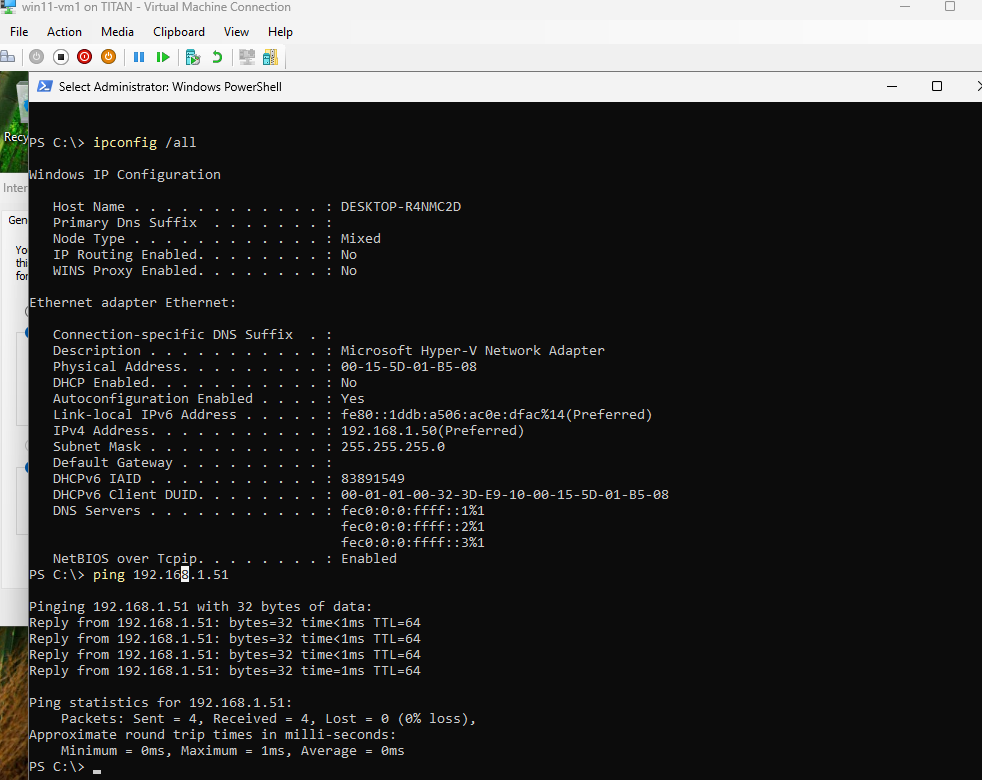

# **Del 3: Kommandoradsarbete &amp; Felsökning (Kursmål 9)**

### **Demonstrera dina färdigheter i kommandoraden genom att genomföra och dokumentera moment i respektive system:**
### **- *Linux (Bash):***
**1. Skapa mappen /var/systementor/konsultdata och filen anteckningar.txt via
CLI.**

```Bash
skola1-ubuntu:/var$ ls
backups  cache  crash  lib  local  lock  log  mail  metrics  opt  run  snap  spool  systementor  tmp
sskola1-ubuntu:/var$ cd systementor/
skola1-ubuntu:/var/systementor$ ls
skola1-ubuntu:/var/systementor$ sudo mkdir konsultdata
skola1-ubuntu:/var/systementor$ ls
konsultdata
skola1-ubuntu:/var/systementor$ cd konsultdata/
skola1-ubuntu:/var/systementor/konsultdata$ sudo touch anteckningar.txt
skola1-ubuntu:/var/systementor/konsultdata$ ls
anteckningar.txt
skola1-ubuntu:/var/systementor/konsultdata$ pwd
/var/systementor/konsultdata

```

**2. Skapa en ny användargrupp (konsulter).**  
```Bash
skola1-ubuntu:/var/systementor/konsultdata$ sudo groupadd konsulter

skola1-ubuntu:/etc$ grep konsulter /etc/group
konsulter:x:1001:
skola1-ubuntu:/etc$ 

```  

**3. Tilldela mappen och filen till gruppen konsulter och ställ in behörigheter enligt
principen om lägsta behörighet (Least Privilege, t.ex. chmod 750 på mappen
och 640 på filen).**  

```Bash  

skola1-ubuntu:/$ sudo chown :konsulter /var/systementor/konsultdata/
[sudo: authenticate] Password:       
skola1-ubuntu:/$ sudo chown :konsulter /var/systementor/konsultdata/anteckningar.txt 
skola1-ubuntu:/$ 
kola1-ubuntu:/$ sudo chmod 750 /var/systementor/konsultdata/
skola1-ubuntu:/$ sudo chmod 640 /var/systementor/konsultdata/anteckningar.txt


```  

**4. Inspektera och dokumentera behörigheterna via CLI (ls -la).**  
```Bash  

skola1-ubuntu:/var/systementor$ ls -la
total 12
drwxr-xr-x  3 root root      4096 Sep 18 17:53 .
drwxr-xr-x 15 root root      4096 Sep 18 17:52 ..
drwxr-x---  2 root konsulter 4096 Sep 18 17:54 konsultdata
skola1-ubuntu:/var/systementor$ 

```

**5. Verifiera nätverksanslutningen till Windows-VM:en med ping samt visa
nätverkskortets detaljer (ip addr show).**  


***  
***  
***  

### **- *Windows (PowerShell):***
**1. Skapa mappen C:\Systementor\KonsultData via CLI.**  
```Bash  
c:\Users\bilal>mkdir -p systementor\konsultData   # eller vill du att det ska vara exakt C:\Systementor\KonsultData ?

c:\Users\bilal>cd ..
c:\Users>cd ..
c:\>mkdir -p systementor\konsultData
```  

**2. Inspektera och dokumentera behörighetsstrukturen/ACL för mappen via
PowerShell (Get-Acl).**  



**3. Verifiera nätverksanslutningen till Linux-VM:en (Test-Connection eller ping)
och inspektera nätverksinställningarna (ipconfig /all).**  

  


**Tack För Din Tid**  
**Skriven av Bilal**

